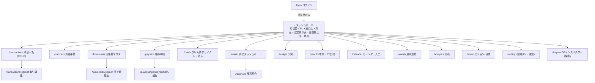

# 画面遷移・API一覧（基本設計の残り / Phase 3）

実装済みの画面（ルート）とAPIエンドポイントの一覧。ナビゲーションはダッシュボード（`/`）が起点。

## 画面遷移図

## 画面（ルート）一覧

| ルート | 役割 | 主な操作 |
|--------|------|----------|
| `/` | ダッシュボード（BIビュー） | 月送り、取引入力（分割払い可）、固定費「実額で記録」、各画面への導線 |
| `/calendar` | カレンダー入力（ADR-034） | 日毎の支出表示、日付タップでその日の入力フォーム＋明細 |
| `/transactions` | 取引一覧（月次） | 閲覧・削除・編集導線・絞り込み（種別/カテゴリ/決済手段） |
| `/transactions/[id]/edit` | 取引編集 | 更新（単一脚に集約） |
| `/transfers` | 資金移動 | 振替/チャージ/カード支払い/現金引出・削除 |
| `/fixed-costs` | 固定費マスタ管理 | 追加・編集・解約(終了年月)・削除 |
| `/fixed-costs/[id]/edit` | 固定費編集 | 更新 |
| `/payslips` | 給与明細一覧 | 月次の総支給/手取り/時給換算 |
| `/payslips/[period]/edit` | 給与明細入力 | 支給/控除の動的行・自動計算 |
| `/cards` | クレカ請求サイクル | 締め別の引落予定額・「引き落とし実行(消込)」 |
| `/assets` | 資産ダッシュボード | 総資産推移・種別内訳・配当・目標達成率 |
| `/reconcile` | 残高照合 | 実残高入力→自動算出との差で記入漏れ検知 |
| `/budget` | 予実 | 収入/支出/収支/総資産の目標vs実績・達成率・月確定(黒塗り) |
| `/year` | FY年次ビュー | 年間PL・月次内訳・黒字推移・FY比較 |
| `/weekly` | 週次進捗（ADR-036） | 週×変動費グループの自動ロールアップ（直近12週） |
| `/analytics` | 分析（ADR-041） | 今月vs直近平均・12ヶ月推移チャート・カテゴリ前月比 |
| `/forecast` | 5か年PL（ADR-044） | 60ヶ月の実績＋見込み・FYサマリ・純資産予測ライン |
| `/monthly` | 月次（ADR-047） | 現運用の月次タブ再現：収入行その場記録・固定費予実・変動費階層・手取り比・月確定 |
| `/settings` | 設定（ADR-017/042/046/047） | 機能の表示ON/OFF、マスタ管理導線、FY開始月、メール通知ルール、送信履歴 |
| `/vision` | ビジョン/目標 | 自由記述の箱 |
| `/inspect` | DBインスペクター | 全テーブル閲覧（本番は `INSPECT_KEY` ＋ `?key=`） |
| `/login` | ログイン（ADR-032） | ユーザー名/パスワード入力→セッションCookie発行。認証無効時は `/` へ |

## API エンドポイント一覧

| メソッド・パス | 役割 |
|----------------|------|
| `GET /api/health` | DB接続＆件数確認 |
| `POST /api/transactions` | 取引作成（単一/分割脚） |
| `PUT /api/transactions/[id]` | 取引更新（脚は単一に集約） |
| `DELETE /api/transactions/[id]` | 取引削除（脚はCASCADE） |
| `POST /api/transfers` | 資金移動作成 |
| `DELETE /api/transfers/[id]` | 資金移動削除 |
| `POST /api/recurring` | 固定費マスタ作成 |
| `PUT /api/recurring/[id]` | 固定費マスタ更新（解約＝終了年月） |
| `DELETE /api/recurring/[id]` | 固定費マスタ削除 |
| `POST /api/recurring/post` | 固定費の予定額を当月の実額取引に記録 |
| `POST /api/payslips` | 給与明細を月ごとにupsert |
| `DELETE /api/payslips/[id]` | 給与明細削除 |
| `POST /api/targets` | 月次目標(収入/支出/収支/総資産)をupsert |
| `POST /api/closings` | 月の確定(黒塗り)トグル |
| `POST /api/snapshots` | 実残高スナップショットをupsert |
| `POST /api/cards/settle` | クレカ請求サイクルの引き落とし消込 |
| `POST /api/vision` | ビジョン/目標の自由記述をupsert |
| `POST /api/payslips/ocr` | 給与明細画像をGeminiで読み取り（`GEMINI_API_KEY` 設定時のみ / ADR-039） |
| `PUT /api/settings` | ユーザー設定（FY開始月・機能の表示ON/OFF）を部分更新（ADR-017/046） |
| `POST /api/notification-rules` | 通知ルール（変動費しきい値）を追加（ADR-042） |
| `PUT /api/notification-rules/[id]` | 通知ルールの ON/OFF |
| `DELETE /api/notification-rules/[id]` | 通知ルール削除（送信履歴もCASCADE） |
| `POST /api/wallets` | ウォレット追加（当面 type='crypto' のみ / ADR-043） |
| `POST /api/auth/login` | パスワードログイン（Google未設定時のフォールバック） |
| `GET /api/auth/google` | Google認可画面へリダイレクト（state Cookie発行 / ADR-037） |
| `GET /api/auth/google/callback` | コード→トークン交換・入場判定・セッション発行 |
| `POST /api/auth/logout` | ログアウト（Cookie削除＋`/login`へ303） |

## 設計メモ
- データ取得はサーバーコンポーネントから `lib/queries.ts` を直接呼ぶ（読み取り）。書き込みは `app/api/**` のRoute Handler（POST/PUT/DELETE）。
- 集計はすべてSQL（残高・合計カラムは持たない／ADR-002・026）。
- マルチユーザー対応済み（ADR-037）：クエリ/APIは `currentUserId()`（セッション→ユーザーID）で解決。認証無効時はオーナー(1)。
- **認証**（ADR-037）：Googleログイン（`GOOGLE_CLIENT_ID`/`GOOGLE_CLIENT_SECRET`/`AUTH_SECRET` で有効化・`AUTH_ALLOWED_EMAILS` で招待）。
  パスワード（`AUTH_USER`/`AUTH_PASSWORD`）はGoogle未設定時のフォールバック。
  全ページは `requireAuth()`（未ログイン→`/login`）、全API（`/api/health` と `/api/auth/*` を除く）は
  `requireAuthApi()`（401）でガード。middleware/proxy は不使用（Vercel 500 回避・ADR-029）。
- **通知**（ADR-042）：取引の書き込み後に `lib/notify.ts` が当月変動費を判定しメール送信（Resend）。
  `RESEND_API_KEY` 未設定時は静かにスキップ。同一ルール×同一月は `notification_log` のUNIQUE制約で1回だけ。
